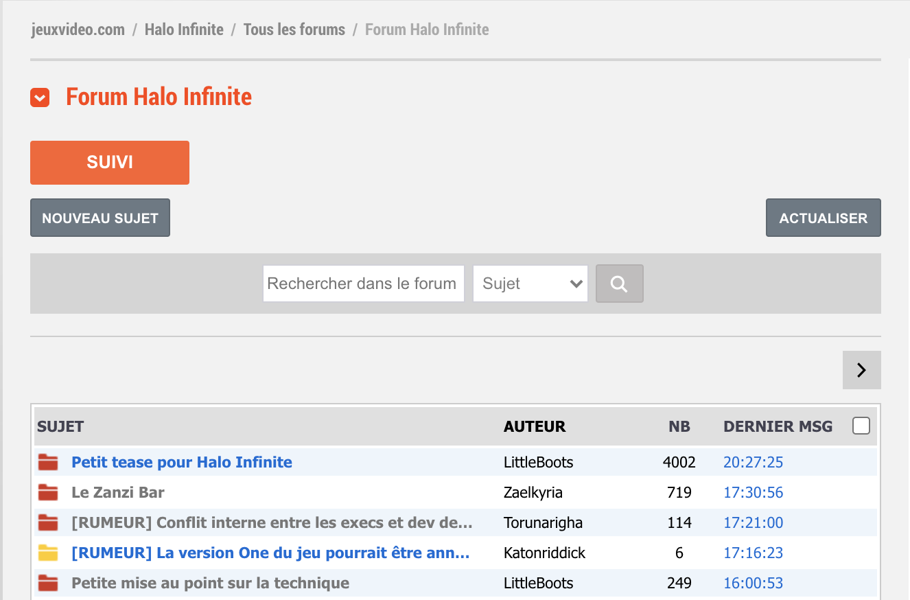
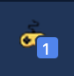
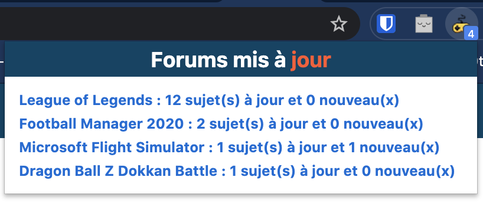
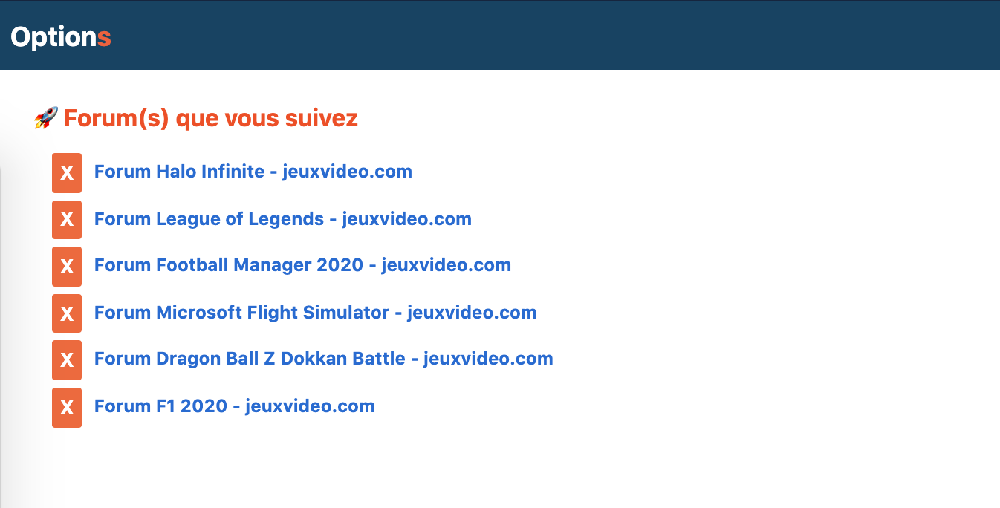

# 🎮 JeuxVideo.com forum amélioration (JV Live)

🎮 Cette extension est dédiée au forum *JeuxVideo.com*. Elle permet d'en améliorer son fonctionnement. 

🚀 Mais quelles fonctionnalités propose-t'elle ?

➕ La gestion du statut des messages est enfin correcte. Si un message est actualisé pendant votre absence, ce dernier sera remis en bleu (statut non lu) à la prochaine visite.
➕ Vous pouvez vous abonner aux forums de votre choix. Cela veut dire que même si vous ne naviguez pas sur le forum, l'extension va se charger d'aller vérifier si ces forums ont du nouveau contenu.
Si oui, le badge de notification de l'extension en affichera le nombre exact.
➕ Si du nouveau contenu est disponible, la fenêtre principale de l'extension vous affiche un lien avec le nombre de message, mais aussi les nouveaux disponibles.
➕Un panneau d'option vous permet de gérer tous vos abonnements. Si vous ne voulez plus suivre un forum, cela se fait en un seul clic.

## 🌎 Installation depuis le Chrome Store

## ⬇️ Installation locale

- Télécharger la [dernière version disponible](https://github.com/remylavergne/jeuxvideo-com-forum-improvement/releases)
- Suivre ce tutoriel pour [installer une extension Chrome](https://developer.chrome.com/extensions/getstarted)

## 🚀 Fonctionnalités

-> Les forums que vous visitez sont mis en cache. Lors de votre prochaine visite, les topics que vous n'avez pas lu, ou vu, seront affichés en bleu (statut non lu classique)

-> Un bouton "**SUIVRE**" s'affiche sur la première page de tous les forums. Ce dernier vous permet de vous abonner aux forums de votre choix, et ainsi de suivre toutes leurs mises à jour.
Même lorsque vous ne naviguez pas sur le site, l'extension vérifie périodiquement *(~ 2 minutes)* si du nouveau contenu est disponible.
Si c'est le cas, le nombre de forums à jour s'affiche sur le badge l'icône de l'extension. En cliquant sur le l'icône de l'extension, vous avez directement la liste.

**Bouton suivre**

**Badge de notification**

**Liste des topics mis à jour**

-> Gestion des forums que vous suivez, ainsi que des options. Vous avez une vu globale et vous pouvez choisir de ne plus suivre un forum d'un simple clic.

## 🚗 Roadmap

- MVP: Refresh ✅
- Background refresh check ✅
- Suivre un forum ✅
- Désactivation de la prévisualisation des messages ✅
- Page d'administration des suivis ✅
- Amélioration de la vérification des mises à jour des forums suivis ✅
- Si un onglet est déjà ouvert, et qu'il correspond au bon forum, le ré-utiliser.
