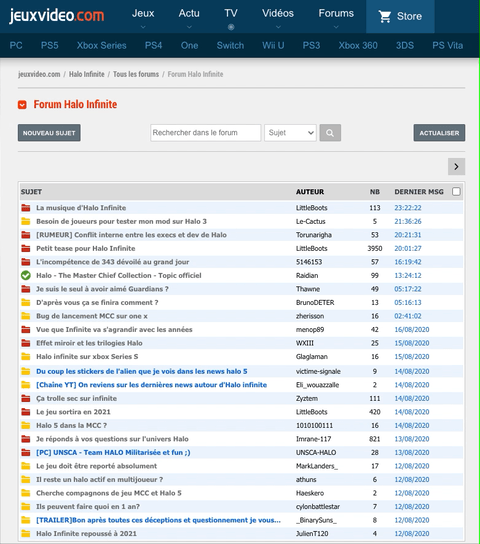

# 🎮 JeuxVideo.com forum amélioration (JVLive)

Cette extension Chrome permet de mettre en évidence les topics qui ont été mis à jour pendant votre absence, pour une meilleure visibilité 🤓

C'est la première version de l'extension. Celle-ci, si utilisée, évoluera en fonctionnalités.

## ⬇️ Installation

Pour l'instant, l'extension n'est pas disponible sur le Store Chrome. Mais vous pouvez quand même l'installer.

- Télécharger la [dernière version disponible](https://github.com/remylavergne/jeuxvideo-com-forum-improvement/releases)
- Et suivre ce tutoriel pour [installer une extension Chrome](https://developer.chrome.com/extensions/getstarted)

## 🚀 Fonctionnalités

-> Les forums que vous visitez sont mis en cache. Lors de votre prochaine visite, les topics que vous n'avez pas lu, ou vu, seront affichés en bleu (statut non lu classique)

-> Un bouton s'affiche sur tous les forums. Ce dernier vous permet de vous abonner aux forums de votre choix, et ainsi de suivre toutes leurs mises à jour.
Même lorsque vous ne naviguez pas sur le site, l'extension vérifie périodiquement *(~ 2 minutes)* si du nouveau contenu est disponible.
Si c'est le cas, une notification, et un raccourci s'afficheront sur l'icône de l'extension.

**Bouton suivre**

**Badge de notification**

**Liste des topics mis à jour**

## 🚗 Roadmap

- MVP: Refresh ✅
- Background refresh check ✅
- Suivre un forum ✅
- Désactivation de la prévisualisation des messages
- Page d'administration des suivis
